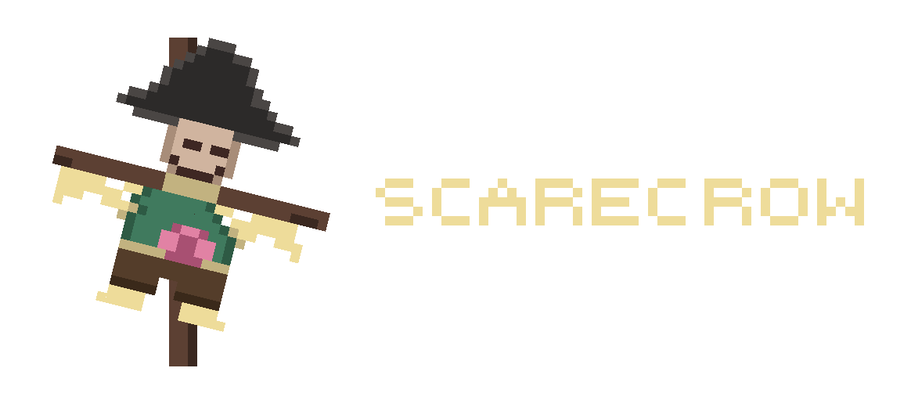

<p align="center">
  
</p>

<p align="center">
  A local-first, always-available transcription companion for macOS.
</p>

---

Scarecrow is a local-first, always-available transcription companion for macOS.
It is designed to run throughout the workday, capture both microphone and system
audio in durable chunks, show live captions as a health check, and let you ask
questions about prior conversations without sending recordings or transcripts
to cloud services.

## Status

**Planning phase.** Repository bootstrap and specification only. No application
code has been implemented yet. Everything below describes planned behavior.

## Planned Goals

- Run as a lightweight daemon all day with minimal resource usage (<200 MB RSS, <5% idle CPU).
- Capture dual-channel audio: mic (your voice) + system audio via BlackHole (call participants).
- Save audio in 30-second Opus chunks so recorder failures lose at most one chunk.
- Filter silence via VAD — only chunks with detected speech are kept.
- Show live captions only when recording and transcription are both healthy.
- Re-transcribe with a larger model every 30 minutes for accuracy, diarization,
  transcript cleanup, and summaries.
- Use local `llama.cpp` GGUF models for transcript cleanup, summaries, and
  query answering.
- Persist recordings, transcripts, and summaries locally in SQLite.
- Answer questions against the transcript timeline using time windows and user-provided context markers.

## Planned Architecture

```
┌─────────────────┐     Unix socket     ┌─────────────────┐
│ scarecrow-daemon │◄──────────────────►│  scarecrow TUI  │
│     (Rust)       │                     │     (Rust)      │
│                  │                     │                 │
│ • Dual-channel   │                     │ • Live captions │
│   audio capture  │                     │ • Health status │
│ • Chunk writing  │                     │ • Note panel    │
│ • Hot-path STT   │                     │ • Query panel   │
│ • VAD filtering  │                     │ • Pause control │
│ • SQLite writes  │                     └─────────────────┘
│ • Worker mgmt    │
└────────┬─────────┘
         │ subprocess (scheduled + on-demand)
         ▼
┌─────────────────┐
│ scarecrow-worker │
│    (Python)      │
│                  │
│ • large-v3 STT   │
│ • transcript     │
│   cleanup        │
│ • Diarization    │
│ • LLM summaries  │
│ • Query answers  │
└─────────────────┘
```

Three processes:
- **Daemon** (Rust): Headless, always running. Captures audio, runs fast transcription, manages storage and worker lifecycle.
- **TUI** (Rust): Connects/disconnects freely. No effect on recording. Modal panels for notes and queries.
- **Worker** (Python): Short-lived, spawned by daemon. Loads heavy models for
  accurate transcription, transcript cleanup, diarization, summaries, and
  query answers. Exits when done.

## Planned Commands

| Command             | Description                        |
|---------------------|------------------------------------|
| `scarecrow start`   | Start the daemon                   |
| `scarecrow`         | Open TUI (connects to daemon)      |
| `scarecrow status`  | Check daemon health from terminal  |
| `scarecrow pause`   | Pause recording                    |
| `scarecrow resume`  | Resume recording                   |
| `scarecrow stop`    | Stop the daemon                    |
| `scarecrow setup`   | First-time setup wizard            |
| `scarecrow delete-last <dur>` | Purge recent recordings (e.g., `5m`) |

## Planned TUI Keybindings

| Key   | Action                                      |
|-------|---------------------------------------------|
| `p`   | Toggle pause/resume recording               |
| `n`   | Open note panel (context, markers, notes)   |
| `q`   | Open query panel (ask questions)            |
| `d`   | Show disk usage detail                      |
| `?`   | Show keybinding help                        |
| `Esc` | Close current panel                         |
| `C-c` | Quit TUI (daemon continues)                 |

## Key Design Decisions

- **Audio format:** Opus (speech-optimized, ~120 KB per 30-second chunk)
- **Audio capture:** Dual-channel stereo — mic (ch1) + system audio via BlackHole (ch2)
- **Storage:** SQLite with FTS5 for full-text transcript search
- **Config:** TOML at `~/.config/scarecrow/scarecrow.toml`
- **Audio retention:** 14 days, then auto-pruned
- **Disk warning:** Alert at 10 GB total usage
- **Music filtering:** Handled by transcription confidence thresholds, not audio routing
- **Local LLM runtime:** Prefer `llama.cpp` with GGUF models for transcript
  cleanup, summaries, and query answering
- **Name-based retrieval:** Resolves through user-provided markers, not automatic speaker ID
- **Privacy:** Auto-pauses on screen lock; `delete-last` purges recent recordings
- **Security:** All data files 0600, directories 0700; model checksums verified; no secrets in config

## Planned Prerequisites

- macOS on Apple Silicon
- **16 GB unified memory** recommended for full cold-path functionality
  (large-v3 + diarization + LLM summaries). 8 GB works with degraded mode
  (cold-path transcription only, no summaries or queries).
- ~10 GB free disk for models (downloaded on first use, not at install)
- [BlackHole 2ch](https://github.com/ExistentialAudio/BlackHole) for system audio capture
  (optional — mic-only mode works without it)
- [HuggingFace account](https://huggingface.co) for pyannote diarization models
  (optional — works without diarization)

## Developer Bootstrap

Until `scarecrow setup` exists, development on a clean MacBook should use a
manual bootstrap path.

Recommended local tools:

- Homebrew
- Xcode Command Line Tools
- `rustup` / Rust toolchain
- `python3`
- `sqlite3`
- `ffmpeg`
- `opus-tools` (`opusenc`)
- BlackHole 2ch
- `llama.cpp`

Suggested install flow:

```bash
xcode-select --install
brew install rustup-init python sqlite ffmpeg opus-tools llama.cpp
rustup-init
source ~/.cargo/env
```

Manual developer setup before the wizard exists:

1. Install BlackHole 2ch if testing dual-channel capture.
2. Create the Multi-Output Device in Audio MIDI Setup.
3. Ensure the physical output device is the clock source and BlackHole drift
   correction is enabled.
4. Keep all devices on the same sample rate, typically 48 kHz.
5. Grant microphone access when the daemon first requests it.
6. If testing diarization, log in with `huggingface-cli` and accept the
   required pyannote model terms before running worker validations.

## Validation Workflow

The canonical validation entrypoint is:

```bash
./scripts/validate.sh
```

This command is expected to grow with the implementation. During planning and
bootstrap it validates repo readiness and reports which build/test layers are
not available yet. During implementation it will become the standard local gate
for formatting, linting, tests, and smoke checks.

## Documentation

- `SPEC.md` — Full v1 specification, data model, state management, and milestones
- `tasks.md` — Implementation task breakdown with acceptance criteria
- `HISTORY.md` — Project decision log
- `DEVELOPMENT.md` — Developer bootstrap and validation expectations for a
  clean machine

## License

[MIT](LICENSE)
